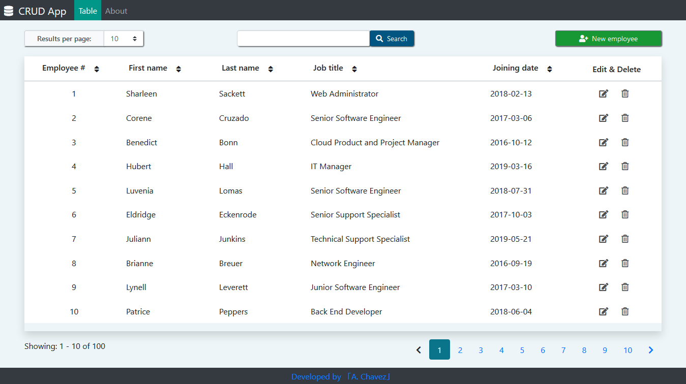

# CRUD system – web application
## Description
This application is an employee management system for a fictional company, it was developed with the purpose of applying the use of a database and its basic operations which are create, read, update and delete.

This application consists of a table which has list of fictional employees whose information can be sorted on an ascending or descending order, it also implements some other functionalities like search, pagination or even select a specific number of results to show per page.
## Technologies used:
* Spring Boot
* Java
* Thymeleaf
* HTML
* CSS
* JavaScript
* Bootstrap
* jQuery
* H2
* PostgreSQL
## Screenshot
